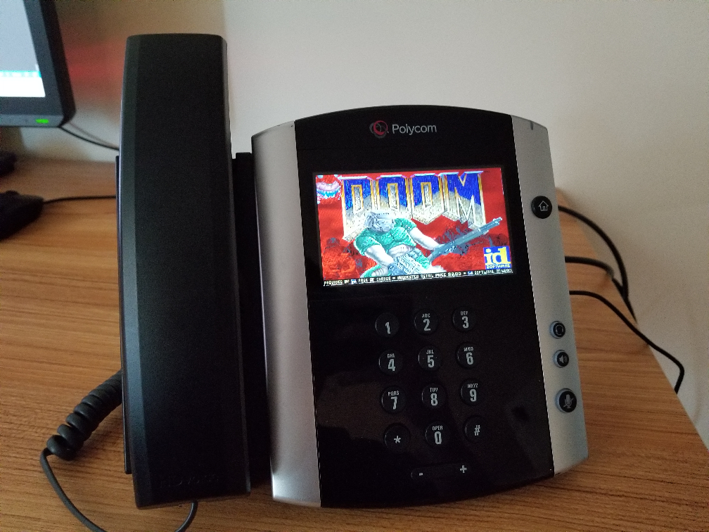

# DoomPhone
This repository contains resources I used to hack an office phone and make it run DOOM. Check out my full technical article on the project [here](https://neilbostian.github.io/#/doomphone).

### What's in this repo?
Each subdirectory played a specific role in the full project to hack this phone and make it run DOOM. This includes C source code that was cross-compiled to run on the ARMv6 processor in the phone, shell scripts, and utilities to gain root access.

#### doom
This directory contains the doom source code and scripts to build & install it to the phone. See [doom/README.md](./doom/README.md) for details.

#### helloworld, display-driver, keypad-driver
These are basic single-file C programs that are cross-compiled and run on the phone to debug and test specific features. Each directory has a `./build.sh` script that can be run to start the phone.

#### phone-utils
These are simple shell scripts to configure the phone so DOOM runs smoothly.

#### UploadFile
This is a simple C# program to replicate web requests to the admin management console on the phone. This is used extensively to gain root access to the phone and enable SSH. This can be run with `cd UploadFile && dotnet run`

#### WebServer
This is a basic webserver in C#. The phone has an embedded web browser that can contact our web server. This is used to gain root access to the phone. This can be run with `cd WebServer && dotnet run`
